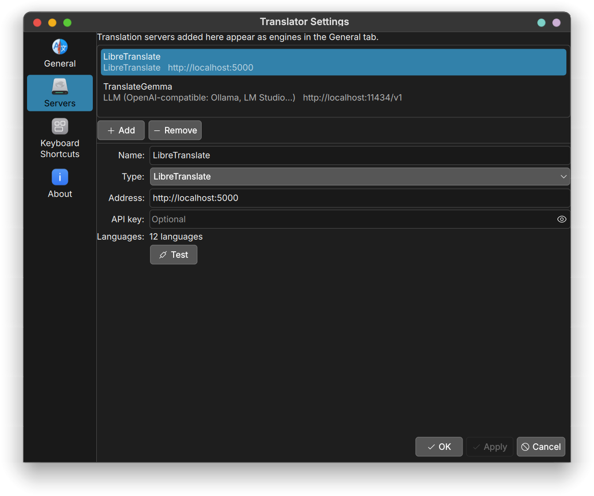
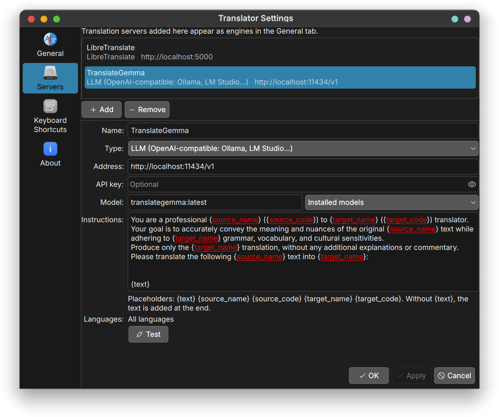

# Translator - KDE Plasma 6 Widget

A Plasma 6 desktop widget that provides a graphical interface for translating text, powered by [translate-shell](https://github.com/soimort/translate-shell).

This is a **port to Plasma 6 / KDE 6** of the original [Translator widget](https://www.pling.com/p/1395666/) created by **Driglu4it** for Plasma 5.

Ported by **rcspam**.


## Features

- Translate text between 160+ languages
- Multiple translation engines: **Google**, **Yandex**, **Bing**, **Apertium**
- Your own translation servers, local or online: LibreTranslate, DeepL, LLMs through Ollama or any OpenAI-compatible API (see below)
- Translate the text selected in any window with a global shortcut, in the right direction
- Auto-detect source language
- Text-to-speech (TTS) pronunciation
- Clipboard integration (copy/paste)
- Swap source and destination languages
- Pin popup window to keep it open
- Searchable and reorderable language list in settings
- Keyboard shortcuts for all actions

## Requirements

- **KDE Plasma 6**
- **translate-shell** (`trans`) package

### Install translate-shell

```bash
# Arch Linux / Manjaro
sudo pacman -S translate-shell

# Debian / Ubuntu
sudo apt install translate-shell

# Fedora
sudo dnf install translate-shell

# openSUSE
sudo zypper install translate-shell
```

translate-shell is not needed to translate with your own servers, only for the built-in engines and for pronunciation.

### Translate the selected text

Give the widget a global shortcut (right click > Configure > Keyboard Shortcuts). Pressing it translates the text currently selected in any window, and shows the result in a small window:

- a text in any other language is translated into your system language
- a text already in your system language is translated into the target language chosen in the widget

The **Destination** menu of that window picks another language by hand. This needs **wl-clipboard** on Wayland, or **xsel** on X11 (package names are the same on the distributions above).

## Translation servers

The **Servers** tab of the settings adds your own translation servers. Each one then shows up as an engine in the **General** tab. Supported types:

| Type | Examples | Languages |
|------|----------|-----------|
| LibreTranslate | self-hosted Docker, public instances | read from the server |
| DeepL | official API, free or pro key | read from the server |
| DeepLX | self-hosted DeepL proxy | DeepL's list |
| LLM (OpenAI-compatible) | Ollama, LM Studio, OpenAI, Mistral, Groq… | all |
| Custom | any HTTP API | all |

The **Test** button translates "Hello world" and refreshes the server's language list. Languages a server does not offer are greyed out in the General tab.

For a custom server, the URL, headers and body accept these placeholders: `{text}` `{source}` `{target}` `{source_name}` `{target_name}` `{api_key}`. The result path points into the JSON answer (`translatedText`, `data.translations.0.text`…); leave it empty when the server answers with plain text.

### Example: LibreTranslate on your machine

[LibreTranslate](https://github.com/LibreTranslate/LibreTranslate) is a free translation server that runs offline. Start it with Docker, loading only the languages you need (the first start downloads the models and takes a few minutes):

```bash
docker run -d --name libretranslate --restart unless-stopped \
  -p 127.0.0.1:5000:5000 \
  libretranslate/libretranslate --load-only en,fr,de,es,it
```

In the **Servers** tab: **Add**, type **LibreTranslate**, address `http://localhost:5000` (the default), no API key. Press **Test**: the server's languages are loaded, and the others are greyed out in the **General** tab. Then pick the server as engine in the **General** tab.



### Example: an LLM with TranslateGemma

[TranslateGemma](https://ollama.com/library/translategemma) is a Gemma model trained for translation. The default size (4B) is a 3.3 GB download; it runs on the CPU, faster with a GPU. With [Ollama](https://ollama.com):

```bash
ollama pull translategemma
```

In the **Servers** tab: **Add**, type **LLM (OpenAI-compatible)**, address `http://localhost:11434/v1` (the default), then type `translategemma:latest` as **Model**, or pick it from the **Installed models** menu next to it. Keep the **Instructions** as they are: this default prompt is TranslateGemma's own format, and it works with general-purpose models too. An LLM translates into any language, so all languages stay available.



The same type works with LM Studio, or with online APIs such as OpenAI, Mistral or Groq: set their address, an API key and a model name.

## Installation

### From .plasmoid file

```bash
kpackagetool6 -t Plasma/Applet -i org.kde.plasma.translator.plasmoid
```

### From source

```bash
git clone https://github.com/rcspam/org.kde.plasma.translator.git
cd org.kde.plasma.translator
kpackagetool6 -t Plasma/Applet -i .
```

### Update

```bash
kpackagetool6 -t Plasma/Applet -u .
```

> **Warning for 6.0.0 users:** do **not** click the "Update" button in the
> widget settings. In 6.0.0 it points to the old Plasma 5 package (0.8) and
> would break the widget. Update through Discover, "Get New Widgets", or the
> command above instead. If you already clicked it, reinstall the widget from
> the store or from this repository. Fixed in 6.0.1.

### Uninstall

```bash
kpackagetool6 -t Plasma/Applet -r org.kde.plasma.translator
```

## Keyboard Shortcuts

| Shortcut     | Action            |
| ------------ | ----------------- |
| `Ctrl+Enter` | Translate         |
| `Ctrl+S`     | Swap languages    |
| `Ctrl+V`     | Paste into source |
| `Ctrl+C`     | Copy translation  |
| `Ctrl+P`     | Pin/unpin popup   |
| `Esc`        | Clear all text    |

## Changelog

### 6.1.2

- Fixed: the update checker never read the installed version, so the settings always showed "Update is available".
- Fixed: an empty area at the top of the settings when no update is available.
- Fixed: the "at least two languages" hint was dark on dark themes.

### 6.1.1

- Fixed: the Changelog button of the update banner opened the page of the old Plasma 5 widget. It now opens the release notes on GitHub.

### 6.1.0

- Your own translation servers: LibreTranslate, DeepL, DeepLX, LLMs through any OpenAI-compatible API (Ollama, LM Studio, OpenAI, Mistral, Groq…) and custom HTTP APIs.
- The selection shortcut works on Wayland (through wl-clipboard), and says which package is missing when it cannot read the selection.
- The selection shortcut picks the direction by itself: a text already in your system language goes to the widget's target language. It works the same with every engine, local LLMs included, without any extra detection service.
- The translation window opens at once with a spinner (useful with slower LLMs), and its Destination menu shows the language the text went to.
- Fixed: a text containing `$(...)` or backticks could run commands through the shell.
- Fixed: a text starting with `-` was read as a translate-shell option and came back empty.
- Fixed: Chinese and Norwegian system languages were not recognised.
- Fixed: the update checker offered any store version different from the installed one, older ones included.

### 6.0.1

- Fixed: the update button installed the old Plasma 5 widget (0.8) and broke the widget.

## Changes from Plasma 5 to Plasma 6

This port includes the following changes to make the widget compatible with KDE Plasma 6:

- **metadata.desktop** replaced by **metadata.json** with Plasma 6 fields
- Root element migrated from `Item` to `PlasmoidItem`
- All QML imports updated to Qt6 (no version numbers)
- `PlasmaCore.DataSource` replaced by `Plasma5Support.DataSource`
- Theme colors migrated from `PlasmaCore.Theme` to `Kirigami.Theme`
- Units migrated from `PlasmaCore.Units` to `Kirigami.Units`
- Controls migrated from QtQuick.Controls 1.x to QtQuick.Controls 2 (`QQC2`)
- SVG rendering migrated from `PlasmaCore.SvgItem` to `Image` + `ColorOverlay`
- MediaPlayer updated for Qt6 API (`audioOutput`, new signal names)
- Connections blocks updated to Qt6 function syntax
- Config page language table rewritten (TableView 1.x replaced by ListView)
- `XmlListModel` replaced by `XMLHttpRequest` for update checking
- Clipboard handling reworked for Qt6 focus model

## Credits

- **Original author:** [Driglu4it](https://www.pling.com/p/1395666/) (Plasma 5 version)
- **Plasma 6 port:** rcspam
- **License:** MIT
